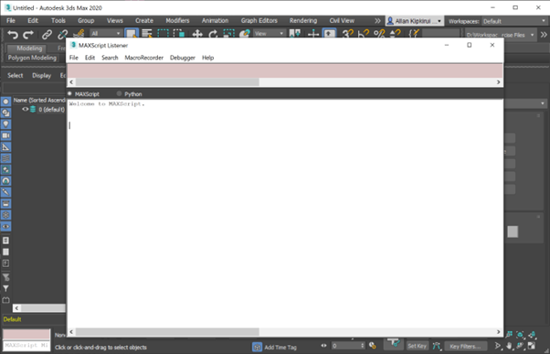
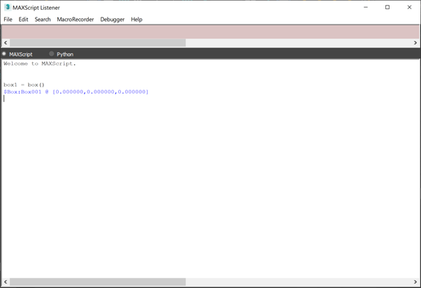
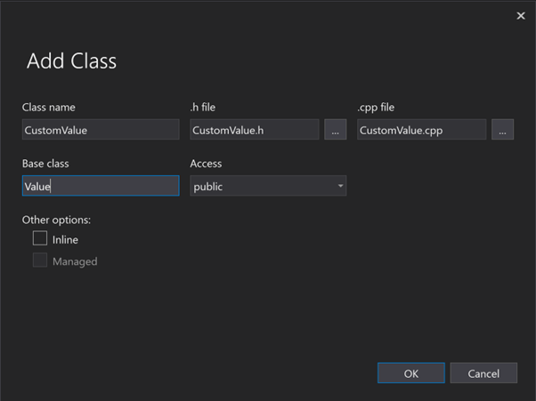
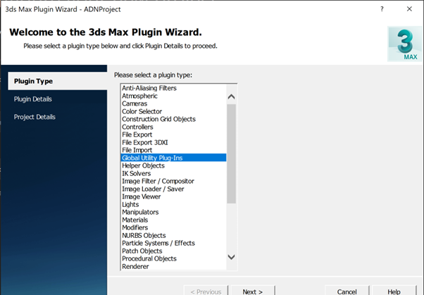
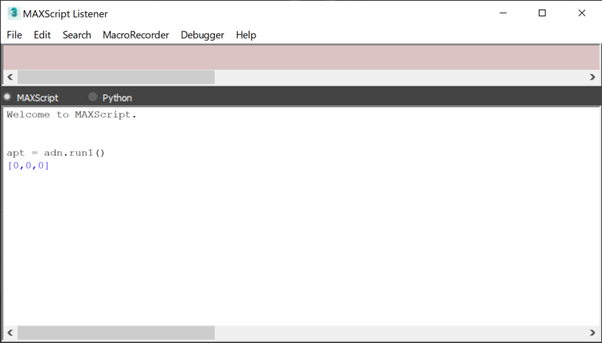

# Building a custom value type for MAXScript
**3ds MAX** is a is a professional 3D computer graphics program that can be used to create 3D animations, models, games, and images. The power that it can do comes not only from the robust UI (User Interface) tools and ease of building plugins but also from the inbuilt scripting capability using Autodesk MAXScript. It is no doubt the power that MAXScript adds to 3ds Max. It is a great scripting method for automation, animation, object creation and manipulation. Lately, it has become the core of initiating 3ds Max Design Automation in the Autodesk Platform Services (formerly Forge). 

## Object Manipulation using MAXScript
To manipulate objects in scene (create, modify, animate, etc.), the returned object on the Maxscript side must give you access to the underlying exposed properties. Let us create a simple box object and look at the exposed properties that the object has.

- Open 3ds MAX software and launch the Maxscript listener window (sample shown in the image below). To launch the listener window, check the steps outlined here [https://knowledge.autodesk.com/support/3ds-max/learn-explore/caas/CloudHelp/cloudhelp/2015/ENU/3DSMax/files/GUID-C8019A8A-207F-48A0-985E-18D47FAD8F36-htm.html](https://knowledge.autodesk.com/support/3ds-max/learn-explore/caas/CloudHelp/cloudhelp/2015/ENU/3DSMax/files/GUID-C8019A8A-207F-48A0-985E-18D47FAD8F36-htm.html).


- Let us create and add a box object to the scene. Add the command  ```box1 = box()```. 

    
    
    The command above creates a primitive type of box object with the name Box001 at x,y,z (0,0,0) as shown below.

    

- Let us begin by viewing all the exposed properties of the box object. We use the command ```getPropNames <object_name>``` i.e., ```getPropNames box1```. This returns a thorough list of properties **# (*#typeinCreationMethod, #typeInPos, #typeInLength, #typeInWidth, #typeInHeight, #length, #width, #height, #widthsegs, #lengthsegs, #heightsegs, #mapcoords, #realWorldMapSize*)**
- We can therefore manipulate the created scene object by changing the values of the associated properties. 
    ```python
    box1.length = 45
    box1.width = 100
    box1.height = 300
    ```
    

- Resultant object on scene is as shown below (notice changes in size as compared to the initial box object)
    


> As noted, each object type on the 3ds MAX does pose some properties that can be manipulated from the MAXScript side. A similar approach can be used to view properties for other objects like **Sphere**, **Cylinder**, **Cone**, etc.

# Making Custom Properties
Building your own custom objects may require you to set up your own custom properties exposed to the MAXScript. This is important as many a times we use primitive objects to build complex objects that we may need to access and manipulate from the MAXScript. As such, any data exposed to MAXScript from the C++ side inherits from the Value type. You can read more about how Value type work in MAXScript here [https://help.autodesk.com/view/MAXDEV/2023/ENU/?guid=GUID-911865D9-A5F9-4686-B01A-243308F41C55](https://help.autodesk.com/view/MAXDEV/2023/ENU/?guid=GUID-911865D9-A5F9-4686-B01A-243308F41C55). 

## Creating a Custom Value Type
- In your project, add a new class to your project, let us call it ```CustomValue```, inheriting the ```Value``` type as shown below.
    

- With that set, add the following snippets to your ```.h``` file
    ```c++
    #include <maxscript/maxscript.h>
    #include <maxscript/foundation/numbers.h>
    #include <maxscript/foundation/3dmath.h>

    #include "resource.h"

    #ifdef ScripterExport
    #undef ScripterExport
    #endif
    #define ScripterExport __declspec( dllexport )


    class CustomValue : public Value
    {
    public:
        ENABLE_STACK_ALLOCATE(CustomValue);

        void		collect() { delete this; }
        void		sprin1(CharStream* s);
        Value* get_property(Value** arg_list, int count);
        Value* set_property(Value** arg_list, int count);
        
        // Generic commands for copying/deleting/showing properties/etc.
        def_generic(delete, "delete");
        def_generic(copy, "copy");
        def_generic(show_props, "showProperties");
        def_generic(get_props, "getPropNames");
    };

    ```

- What do these functions do?
    - ```void sprin1(CharStream* s)``` – returns a string representation of the object. When instantiating the object from MAXScript, a string is returned showing the default or set values.
    - ```Value* get_property(Value** arg_list, int count)``` – Used to get property values into the MAXScript side. When a property is accessed from the MAXScript i.e., during computation, this function is called automatically, and it returns the current set value of the property.
    - ```Value* set_property(Value** arg_list, int count)``` – Similar to get_property, but in this case use to pass a new value from the MAXScript to the c++. Basically, used to update property values. It is also called automatically when assigning a value to a property. I.e., *box1.pos = [0.5,3.4,5.6]*
    - ```def_generic(get_props, "getPropNames")``` – Defines a generic property called ```getPropNames``` used in Maxscript to return all property names that can be accessed from MAXScript and maps it to an internal function in our class called ```get_props```.

With all declarations done, let's now implement the functionality before adding new property types to our class.

```c++
    Value* CustomValue::get_property(Value** arg_list, int count)
    {
        return Value::get_property(arg_list, count);
    }

    Value* CustomValue::set_property(Value** arg_list, int count)
    {
        return Value::set_property(arg_list, count);
    }

    Value* CustomValue::delete_vf(Value** arg_list, int count)
    {
        return &ok;
    }


    Value* CustomValue::copy_vf(Value** arg_list, int count)
    {
        return this;
    }

    void
    CustomValue::sprin1(CharStream* s)
    {
        // String reprentation of the data ie Point3Vales
    }

    Value* CustomValue::get_props_vf(Value** arg_list, int count)
    {
        // getPropNames <max_object> [#dynamicOnly] -- returns array of prop names of wrapped obj

        MAXScript_TLS* _tls = (MAXScript_TLS*)TlsGetValue(thread_locals_index);
        one_typed_value_local_tls(Array * result);
        vl.result = new Array(0);
        return_value_tls(vl.result);
    }

    Value* CustomValue::show_props_vf(Value** arg_list, int count)
    {
        // showProperties <max_object> [_T("prop_pat")] [to:<file>]   - applies to ref0 in the wrapper

        return &false_value;
    }
```


Let us add new properties. First, a property is defined as follows.
- ```def_property(<property name>)``` – Added to the class
- ```Value* CustomValue::get_<property name>(Value** arg_list, int count)``` – getter function for the property
- ```Value* CustomValue::set_<property name>(Value** arg_list, int count)``` – setter function for the property


Let us create a couple of properties that can be manipulated from Max side. We define it as follows.
- ```Point3 m_pos``` – A Point3 object that we intend to expose to MAXScript
- ```def_property(pos)``` – A property called pos that we will return the m_pos above
- ```def_property(x)``` – The x-coordinate of the Point3 m_pos created
- ```def_property(y)``` – The y-coordinate of the Point3 m_pos created
- ```def_property(z)``` – The z-coordinate of the Point3 m_pos created


Consequently, lets create the setter and getter functions for each of the properties above i.e.,


```c++
Value* CustomValue::get_pos(Value** arg_list, int count)
{
    return new Point3Value(m_pos);
}

Value* CustomValue::set_pos(Value** arg_list, int count)
{
    m_pos = arg_list[0]->to_point3();
    return arg_list[0];
}
```

For the ***x,y,z*** properties, it is like the implementation above. Check the full code link attached for the implementation. Implement the ```get_props_vf``` function by adding the four properties to the result array. 

### Last touches:
> - Added the 4 properties to the ```get_props_vf()``` function in the result array
> - Add a default constructor for the CustomValue and instantiate the *m_pos* variable to a Point3 value
> - Bonus, implement the ```show_props_vf()``` function in the ```CustomValue.cpp```

<br />
<br />
<br />

# Bonus Tip!
### Building and Running the Snippet above

---
> This assumes you have already installed Visual Studio, 3ds MAX and 3ds MAX SDK. Check on how to setup the 3ds Max SDK and plugin wizard if you do not have that already. This is covered in the 3ds MAX documentation here [www.help.autodesk.com/view/MAXDEV/2023/ENU/?guid=installing_the_plug-in_wizard_ap](www.help.autodesk.com/view/MAXDEV/2023/ENU/?guid=installing_the_plug-in_wizard_ap)
---

<br />
To enable us to build and run our created class, we will be using a StaticInteface in a Global Utility interface (GUT) plugin type in 3ds MAX SDK. Let us first create a global utility object (GUT) using the Plugin Wizard. The wizard will create a barebone project with all required functions for us to implement them.

<br /> 



Next, we will add a static interface to expose a static object to the 3ds MAX side. This is the instance we will be using when getting and manipulating properties from the MAXScript. In Visual Studio, add a new class, let us call it ADNStaticInterface and add the following snippets.

```c++
class ADNStaticInterface : public FPStaticInterface 
{

public:

	// The follow exposes our functions to Max
	enum FN_IDS {
		fn_run1
	};
	BEGIN_FUNCTION_MAP		        
		FN_0(fn_run1, TYPE_VALUE, run1);
	END_FUNCTION_MAP

	// Implement the functions exposed above
	Value* run1();

	// General purpose exposure
	static ADNStaticInterface* GetInstance() { return &_theInstance; }

private:
	DECLARE_DESCRIPTOR(ADNStaticInterface);

	// The single instance of this class
	static ADNStaticInterface _theInstance;

	// Point3CustomValue *m_customValue;
	CustomValue* m_customValue;
};

```

We first begin by exposing our function to MAX; first an Enum of function ids ```(fn_run1)```
- ```Value* run1()``` - This defines a function that will be called from Maxscript and returns a Value type. The return value object will allow manipulation of the properties.
- ```static ADNStaticInterface* GetInstance()``` – Returns a static access object

Let us implement the declared functions. Beginning with the 
```c++
ADNStaticInterface ADNStaticInterface::_theInstance
(
	IADN_STATIC_INTERFACE, _T("ADN"), 0, NULL, FP_CORE,
	ADNStaticInterface::fn_run1, _T("run1"), 0, TYPE_VALUE, 0, 0,
	
    p_end
);
```

The function declares an ADN (Autodesk Developer Network) object that can be used from the MAX side to call the functions in the C++ side.

```c++
Value* ADNStaticInterface::run1()
{
	Point3Value* nValue = new Point3Value(0.0, 0.0, 0.0);

	return nValue;
}
```

The run1 function returns an object to the MAXScript side. We have just set up a Point3Value to be returned to the MAXScript. The Point3Value is a Point3 type which inherits from the Value class to enable exposing the values to MAXScript. 

Let us build and run the code to test if all works so far. Run the project within visual studio, with 3ds MAX launched, open the MAXScript listener window and run the command ```apt = adn.run1()```, you should be getting an output like below.



If that works so far, let us now proceed to building our own custom value type. Remember all values exposed to Maxscript must be of the Value type (inherits from the value type). 

Running the custom value to the Static Interface
Attach the new CustomValue to the ```ADNStaticInterface``` class and return it in the ```run1()``` method.
- Include the custom value header to the ```ADNStaticInterface.h```
- Add a private member object of the ```CustomValue``` type i.e., ```CustomValue* m_value```
- In the ```run1()``` function, instantiate the CustomValue and return it from the function.

Run the program and manipulate the properties as shown below.


Check out the full project code attached or from the git link below. <br />
[Full Source Code Link](link to code)

<br />
<br />

----

> I hope that was quite descriptive way of creating your own custom value type for MAXScript. I would love to hear if you find better ways of doing it.
> 
> Any questions? Feel free to reach out. Cheers!

